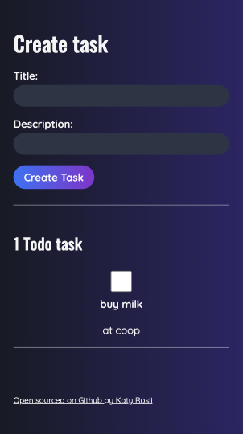
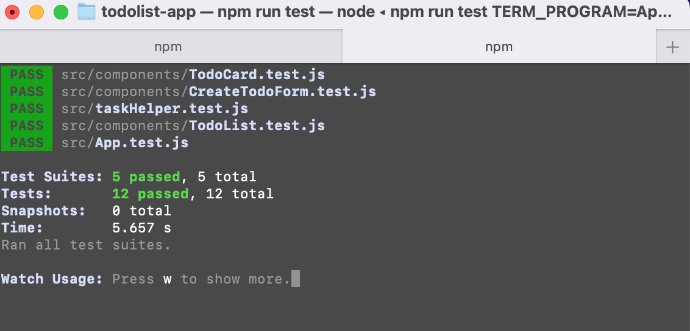

# Todo List React Js App :

- A responsive Todo list web app created using React Js. Mobile first approach.
- Functions: able to create a new Todo list, store the data in local storage and I also wrote test for each of the components. Check out my screenshots below that I passed all the test I wrote.
- Design of this web app (both UX & UI) are all designed by me.

# Built with 🛠️:
- React
- JavaScript
- HTML
- CSS
- Jest
- Figma
- Netlify

# Live Demo:
[Live Demo Link] (https://dreamy-belekoy-14f19e.netlify.app/)

## Available Scripts

In the project directory, you can run:

### `npm start`

Runs the app in the development mode.\
Open [http://localhost:3000](http://localhost:3000) to view it in your browser.

The page will reload when you make changes.\
You may also see any lint errors in the console.

### `npm test`

Launches the test runner in the interactive watch mode.\
See the section about [running tests](https://facebook.github.io/create-react-app/docs/running-tests) for more information.

### `npm run build`

Builds the app for production to the `build` folder.\
It correctly bundles React in production mode and optimizes the build for the best performance.

# Author:
👩 **Katy Rosli**
- GitHub: [@KatyRosli](https://github.com/KatyRosli)

# Show your support:
Give a ⭐️ if you like this project!

Thank you!